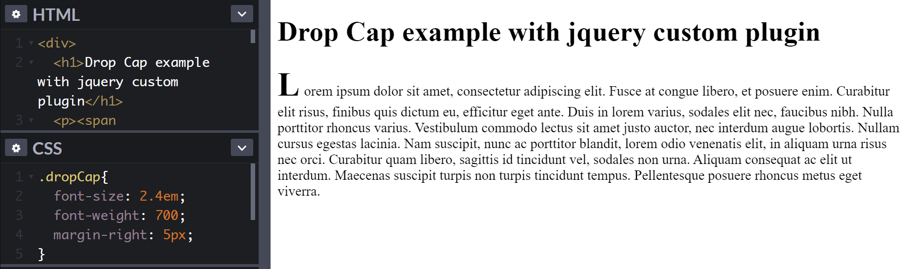

Jquery has been used quite largely in many web projects because it gives you all javascript functions and commands wrapped in a nice API interface. For example: "jquery selectors", used very heavily.

Also, there were a lot of plugins which were build on top of jquery. for example: bootstrap's modal, tooltip etc.

Example usage of bootstrap modal:

```javascript
$("#target").modal("show")
```

Whenver we use `$` instead of `document.querySelector()` it returns a jquery object which has some methods available like `.css(), .click()` etc.

> Jquery object gets these methods from `$.fn` object

So, let's say we want to write our own method and add it in `$.fn` definition so that every jquery object can also use that method.

Let's take a use case of [Dropcap/s](https://css-tricks.com/snippets/css/drop-caps/). We want to apply a function on a jquery object which will basically make the first letter bigger in size relative to the sentence or paragraph.
(_Something like we see in newsletters_ 🤔)

Let's name this function `dropCap` and the definition will look somthing like this:

```javascript
$.fn.dropCap = function () {
  // your definition goes here
}
```

We can use this function on any jquery object now:

```javascript
$(".some-element").dropCap()
```

and it will execute whatever functionality we write in our `dropCap` function.

### Protecting the `$` Alias and Adding Scope

[Detail explanation](https://learn.jquery.com/plugins/basic-plugin-creation/#protecting-the-alias-and-adding-scope)

Since the `$` variable is very popular among JavaScript libraries, we need to scope it and map it to `jQuery` variable by using a [Immediately Invoked Function Expression](http://benalman.com/news/2010/11/immediately-invoked-function-expression/)

```javascript
;(function ($) {
  $.fn.dropCap = function () {
    // your definition goes here
  }
})(jQuery)
```

⏲ Now, we can write some css for our `dropCap` class

```css
.dropCap {
  font-size: 2.4em;
  font-weight: 700;
  margin-right: 5px;
}
```

This will give the dropcap effect when we apply this class to first letter.



Let's finallly add the code for our plugin

```javascript
;(function ($) {
  $.fn.dropCap = function () {
    val = this.text()
    first_letter = val.substring(0, 1)
    dropCapLetter = `<span class='dropCap'>${first_letter}</span>`
    this.html(dropCapLetter + val.substring(1))
  }
})(jQuery)
```

Above function reads the passed jquery object and updates the first letter of the paragraph as dropCap letter.

#### Codepen example

<iframe height="265" style="width: 100%;" scrolling="no" title="GRZPBRE" src="https://codepen.io/bhansa/embed/preview/GRZPBRE?height=265&theme-id=dark&default-tab=html,result" frameborder="no" loading="lazy" allowtransparency="true" allowfullscreen="true">
  See the Pen <a href='https://codepen.io/bhansa/pen/GRZPBRE'>GRZPBRE</a> by Bharat Saraswat
  (<a href='https://codepen.io/bhansa'>@bhansa</a>) on <a href='https://codepen.io'>CodePen</a>.
</iframe>

Thanks for reading, I hope it was helpful in some way 😃✨

---

#### References

[Advance plugin concepts](https://learn.jquery.com/plugins/advanced-plugin-concepts/)
